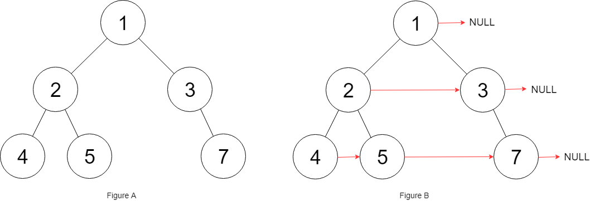

# 填充每个节点的下一个右侧节点指针 II

给定一个二叉树

```text
struct Node {
  int val;
  Node *left;
  Node *right;
  Node *next;
}
```
填充它的每个 next 指针，让这个指针指向其下一个右侧节点。如果找不到下一个右侧节点，则将 next 指针设置为 NULL。

初始状态下，所有 next 指针都被设置为 NULL。
进阶：

你只能使用常量级额外空间。
使用递归解题也符合要求，本题中递归程序占用的栈空间不算做额外的空间复杂度。


示例：



```text
输入：root = [1,2,3,4,5,null,7]
输出：[1,#,2,3,#,4,5,7,#]
解释：给定二叉树如图 A 所示，你的函数应该填充它的每个 next 指针，以指向其下一个右侧节点，如图 B 所示。序列化输出按层序遍历顺序（由 next 指针连接），'#' 表示每层的末尾。

```

提示：

* 树中的节点数小于 6000
* -100 <= node.val <= 100

来源：力扣（LeetCode）
链接：https://leetcode-cn.com/problems/populating-next-right-pointers-in-each-node-ii
著作权归领扣网络所有。商业转载请联系官方授权，非商业转载请注明出处。

