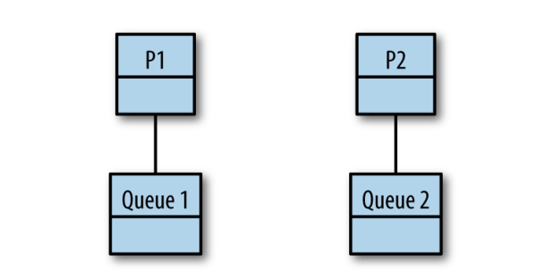

# Work Stealing

公平调度可能的问题:
In a fork-join paradigm, tasks are likely dependent on one another, and it turns out
naively splitting them among processors will likely cause one of the processors to be
underutilized. Not only that, but it can also lead to poor cache locality as tasks that
require the same data are scheduled on other processors.

work stealing 也许能解决
This is the first type of work stealing algorithm we’ll look at. Does this solve the problem?

It’s better than simply dividing the tasks among the processors
because it solves the problem with underutilized processors, 
but we’ve now introduced a centralized data structure that all the processors must use.

给每个处理器都增加一个双端队列:
The next leap we could make is to decentralize the work queues. We could give each
processor its own thread and a double-ended queue, or deque, like this:


Let’s go through the rules of how a
work-stealing algorithm operates with distributed queues.

As a refresher, remember that Go follows a fork-join model for concurrency. Forks
are when goroutines are started, and join points are when two or more goroutines are
synchronized through channels or types in the sync package. 
The work stealing algorithm follows a few basic rules. Given a thread of execution:

1. At a fork point, add tasks to the tail of the deque associated with the thread.
2. If the thread is idle, steal work from the head of deque associated with some
   other random thread.
3. At a join point that cannot be realized yet (i.e., the goroutine it is synchronized
   with has not completed yet), pop work off the tail of the thread’s own deque.
4. If the thread’s deque is empty, either:  
   a. Stall at a join.  
   b. Steal work from the head of a random thread’s associated deque.

This is a bit abstract, so let’s look at some real code and see this algorithm in action.
Take the following program, which computes the Fibonacci sequence recursively:
```go
package main

import "fmt"

func main() {
	var fib func(n int) <-chan int
	fib = func(n int) <-chan int {
		result := make(chan int)
		go func() {
			if n <= 2 {
				result <- 1
				return
			}

			result <- <-fib(n-1) + <-fib(n - 2)
		}()
		return result
	}

	fmt.Printf("fib(4) = %d", <-fib(4))
}

```

Now, let’s examine some interesting properties of this algorithm. Recall that a thread
of execution both pushes and (when necessary) pops from the tail of its work deque.
The work sitting on the tail of its deque has a couple of interesting properties:  
* It’s the work most likely needed to complete the parent’s join.
  * Completing joins more quickly means our program is likely to perform better,
    and also keep fewer things in memory.
* It’s the work most likely to still be in our processor’s cache.
  * Since it’s the work the thread was last working on prior to its current work, it’s
    likely that this information remains in the cache of the CPU the thread is executing on. 
    This means fewer cache misses!
