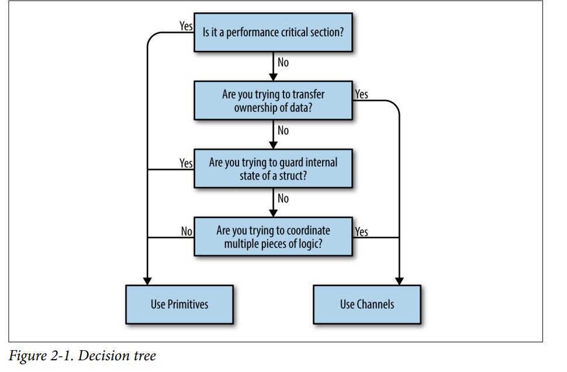

#Go's Philosophy Concurrency

Do not communicate by sharing memory.
Instead, share memory by communicating.

Next enumerates these guideposts into a decision tree.



# Goroutines 
1.the garbage collector does nothing to collect goroutines 
that have been abandoned somehow. 
If I write the following:
```
go func() {
	// <operation that will block forever>
}()
// Do work
```
The goroutine here will hang around until the process exit.  
GC 不会回收 block forever 的 goroutine 
2.Go’s mechanism for hosting goroutines is an implementation of what’s called an M:N
scheduler, which means it maps M green threads to N OS threads. Goroutines are then
scheduled onto the green threads.
goroutine 调度在绿色线程中

3.This is an interesting side note about how Go manages memory. The Go runtime is
observant enough to know that a reference to the salutation variable is still being
held, and therefore will transfer the memory to the heap so that the goroutines can
continue to access it.
Go 将闭包内要访问闭包外的变量，将内存移到堆中

4.Since multiple goroutines can operate against the same address space, we still have to
worry about synchronization.
goroutines 中并发问题

5.A newly minted goroutine is given a few kilobytes, which is almost always enough.
创建一个 goroutine 花费比创建一个 thread 要小很多

6.Context Switching
OS Thread:  
The OS thread must save things like register values, lookup tables, and memory maps to successfully be able to switch
back to the current thread when it is time. Then it has to load the same information
for the incoming thread.
That gives us 1.467 μs per context switch.
Software:
Context switching in software is comparatively much, much cheaper. Under a
software-defined scheduler, the runtime can be more selective in what is persisted for
retrieval, how it is persisted, and when the persisting need occur.

软件方式的上下文切换比 OS Thread 线程切换消耗少, 
Goroutine 上下文切换计算的 benchmark 例子代码在: ./benchmark-context-switch
测试命令:
```text
cd benchmark-context-switch
go test -bench=. -cpu=1 
```

# The sync Package

The sync package contains the concurrency primitives that are 
most useful for low-level memory access synchronization.
低级别的内存访问同步

## WaitGroup
用法
WaitGroup is a great way to wait for a set of concurrent operations to complete when
you either don’t care about the result of the concurrent operation, or you have other
means of collecting their results. If neither of those conditions are true, I suggest you
use channels and a select statement instead.
1. 不关心结果的返回
2. 结果的返回由其他方式整合
3. 不符合以上两个条件, 相应使用 channels 和 select statement

WaitGroup.Add 应该在 goroutine 外执行，不然 WaitGroup.Wait 不会阻塞
WaitGroup example: ./wait-group-example
   
## Mutex And RWMutex
### Mutex
Mutex stands for “mutual exclusion” and is a way to guard critical sections of your program.
a critical section is an area of your program that requires exclusive access to a shared resource.
独占访问共享资源
To borrow a Goism, whereas channels share memory by communicating, 
a Mutex shares memory by creating a convention developers must follow to synchronize access to the memory.

Mutex example: ./mutex-in-decrement
### RWMutex
The sync.RWMutex is conceptually the same thing as a Mutex: it guards access to memory; however,   
RWMutex gives you a little more control over the memory. 
You can request a lock for reading, in which case you will be granted access unless the
lock is being held for writing. This means that an arbitrary number of readers can
hold a reader lock so long as nothing else is holding a writer lock.

RWMutex And Mutex contrast example: ./rwmutex-mutex-contrast
## Cond
Cond def:
...a rendezvous point for goroutines waiting for or announcing the occurrence of an event.  
In that definition, an “event” is any arbitrary signal between two or more goroutines
that carries no information other than the fact that it has occurred.
使用例子:
看上去我们在等待条件发生时一直保持着这个锁的时候，我们一直持有这个锁，但实际上并不是这样的。
进入 Wait 的时候, 会调用 L.Unlock()， 退出 Wait 时, 会自动调用 L.Lock()
```text
c := sync.NewCond(&sync.Mutex{}) // 1.
c.L.Lock() // 2. 
for conditionTrue() == false {
    c.Wait() // 3.
}
c.L.Unlock() // 4.
```
1. Here we instantiate a new Cond. The NewCond function takes in a type that satis‐
   fies the sync.Locker interface. This is what allows the Cond type to facilitate
   coordination with other goroutines in a concurrent-safe way.
2. Here we lock the Locker for this condition. This is necessary because the call to
   Wait automatically calls Unlock on the Locker when entered.
3. Here we wait to be notified that the condition has occurred. This is a blocking
   call and the goroutine will be suspended.
4. Here we unlock the Locker for this condition. This is necessary because when the
   call to Wait exits, it calls Lock on the Locker for the condition.

In my opinion, this takes a little getting used to; it’s effectively a hidden side
effect of the method. It looks like we’re holding this lock the entire time while we wait
for the condition to occur, but that’s not actually the case. When you’re scanning
code, you’ll just have to keep an eye out for this pattern.

sync.Cond 比 channel 的性能要好  
In addition, the Cond type is much more performant than utilizing channels.

## Once
As the name implies, sync.Once is a type that utilizes some sync primitives internally
to ensure that only one call to Do ever calls the function passed in—even on different
goroutines.

1. This is because sync.Once only counts the number of times Do is called, not how many times unique functions passed into Do are called.  
   sync.Once 只会执行一次，不会执行调用的函数
   
2. sync.Once 也会发生死锁行为, 例子: ./once-deadlock-example  
   For some, this may be slightly counterintuitive since 
   it appears as though we’re using sync.Once as intended 
   to guard against multiple initialization, 
   but the only thing sync.Once guarantees is that your functions are only called once.
   
## Pool
Pool is a concurrent-safe implementation of the object pool pattern.
At a high level, a the pool pattern is a way to create and make available a fixed number, or pool, of things for use.
It’s commonly used to constrain the creation of things that are expensive (e.g., database connections)
so that only a fixed number of them are ever created, 
but an indeterminate number of operations can still request access to these things. 
In the case of Go’s sync.Pool, this data type can be safely used by multiple goroutines.

simple example: ./pool/pool-simple-example
模拟网络连接缓存池例子: ./pool/pool-net-benchmark

However, there is one thing to be wary of when determining whether 
or not you should utilize a Pool: if the code that utilizes the Pool requires things 
that are not roughly homogenous, you may spend more time converting 
what you’ve retrieved from the Pool than it would have taken to just instantiate it in the first place.  
如果需要的实例不尽相同的时候，可能不适合用 sync.Pool
使用 Pool 的几个关注点:
```text
So when working with a Pool, just remember the following points:
• When instantiating sync.Pool, give it a New member variable that is thread-safe when called.
• When you receive an instance from Get, make no assumptions regarding the state of the object you receive back.
• Make sure to call Put when you’re finished with the object you pulled out of the pool. Otherwise, the Pool is useless. Usually this is done with defer.
• Objects in the pool must be roughly uniform in makeup
```

# Channels
Channels are one of the synchronization primitives in Go derived from Hoare’s CSP.
While they can be used to synchronize access of the memory, they are best used to
communicate information between goroutines.

To use channels, we’ll once again make use of the <- operator. Sending is done by
placing the <- operator to the right of a channel, and receiving is done by placing the
<- operator to the left of the channel. Another way to think of this is the data flows
into the variable in the direction the arrow points.  
另一种理解方式是，数据按照箭头所指的方向流向变量。  
Let’s take a look at a simple example:
```go
package main

import "fmt"

func main()  {
   stringStream := make(chan string)
   go func() {
      stringStream <- "Hello channels!"
   }()

   fmt.Println(<-stringStream)
}
```
当一个通道被关闭时，将自动中断循环。  
The range keyword—used in conjunction with the for statement—supports channels as arguments, 
and will automatically break the loop when a channel is closed.

# The select Statement
channel 和 选择语句 组合在一起使用，可以发挥出更大的威力。  
The select statement is the glue that binds channels together; 
it’s how we’re able to compose channels together in a program to form larger abstractions.
It is not an overstatement to say that select statements are one of the most crucial things 
in a Go program with concurrency.
通过 channel 和 选择语句 可以安全地做到取消、超时、等待和默认值，这些事情。  
The select statements can help safely bring channels together with concepts like cancellations, timeouts, waiting, 
and default values.
三个有关 select 语句和 channel 的问题
This is a simple and efficient way to block while we’re waiting for something to hap‐
pen, but if we reflect for a moment we can come up with some questions:
• What happens when multiple channels have something to read?
   The Go runtime will perform a pseudorandom uniform selection over the set of case statements.
• What if there are never any channels that become ready?
   If there’s nothing useful you can do when all the channels are blocked, 
   but you also can’t block forever, you may want to time out.  
   example: ./select-statement/timeout
• What if we want to do something but no channels are currently ready?  
   Like case statements, the select statement also allows for a default clause in case you’d like to do something 
   if all the channels you’re selecting against are blocking.
   当所有的 case 被阻塞时, 可以使用 default 选项执行你的任务。
   example: ./select-statement/default  
   Usually you’ll see a default clause used in conjunction with a for-select loop.
   This allows a goroutine to make progress on work while waiting for another goroutine to report a result.
   可以使用 for-select 、 close channel 组合, 判断是否应该退出死循环, 还是继续执行默认任务。
   for-select loop exit example: ./select-statement/for-select-loop

# The GOMAXPROCS Lever
In my opinion, the name is misleading: people often think this function relates to the number of logical processors 
on the host machine—and in a roundabout way it does—but really this function controls the number of OS threads 
that will host so-called “work queues.”
GO 1.5 版本之后，GOMAXPROCS 与 主机的 CPU 数量保持一致:  
runtime.GOMAXPROCS(runtime.NumCPU())   
一般情况下，不会调整这个值，可以通过调整这个值，来完成以下情况:
1. By increasing GOMAXPROCS beyond the number of logical CPUs we had, 
   we were able to trigger the race conditions much more often, and thus get them corrected faster.
   提高这个值，频繁地触发竞赛条件，从而更快地纠正它们。